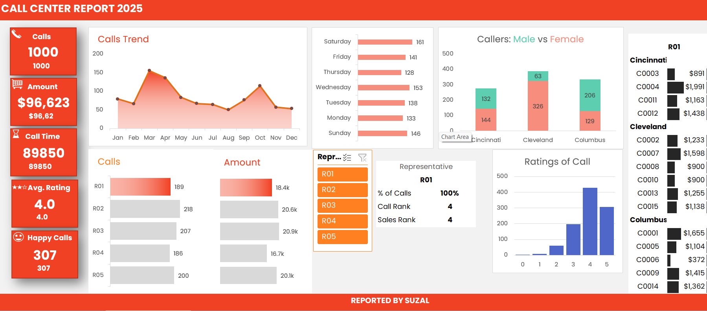

<h1 align="center">📞 Call Center Data Analysis Dashboard</h1>

This project presents a detailed **Excel dashboard** analyzing the performance of a call center team with 5 representatives. It offers dynamic, interactive insights into customer interactions, sales, feedback, and demographic trends using Excel's most powerful features.

---

## 🔍 Overview

This dashboard helps understand and analyze:
- 📈 Weekly sales trends (Sunday, Monday, etc.)
- 🧑‍💼 Representative performance
- 💰 Number of calls received vs. sales closed
- ⭐ Customer ratings and satisfaction
- 🌐 Country and state-wise analysis
- 🧑‍🤝‍🧑 Gender analysis (Male vs. Female customers)
- 📬 Customer details and engagement quality

All these insights are made easily explorable using **slicers**, **pivot tables**, and **pivot charts**.

---

## ⚙️ Key Excel Features Used

- 🔄 **Data Cleaning & Processing**
  - Removed duplicates, handled nulls, standardized entries

- 📊 **Pivot Tables & Charts**
  - Multiple connected pivot tables for dynamic filtering
  - Graphical representations of performance metrics

- 🔗 **Slicers**
  - Interactive slicers for date, representative, state, and gender

- 🎨 **Advanced Conditional Formatting**
  - Highlighted key performance indicators
  - Color-based customer rating scales

- 🧩 **Data Relationships**
  - Connected different tables for centralized analysis

---

## 💡 Insights You Can Draw

- Who is the top-performing representative?
- Which day of the week shows peak sales?
- Which state/country gives the most business?
- What’s the customer satisfaction level by gender?
- How does customer engagement vary across regions?

---

## 📷 Preview

> *(Add a screenshot of your Excel dashboard here for better visibility)*

---

## 🚀 How to Use

1. Download the Excel file.
2. Open it in **Microsoft Excel 2016 or newer**.
3. Use the slicers to explore different segments and trends.
4. Review the graphs and KPIs to derive insights.

---

## 📌 Ideal For

- Data analysts working on customer service data
- Call center managers and sales performance trackers
- Excel learners exploring dashboards and pivot interactivity

---

## 🙋‍♂️ Created By

Dashboard designed and developed by **Suzal**  
Passionate about data analysis and building smart insights through Excel and AI integration.

---

## 📜 License

Open-sourced under the [MIT License](LICENSE).
